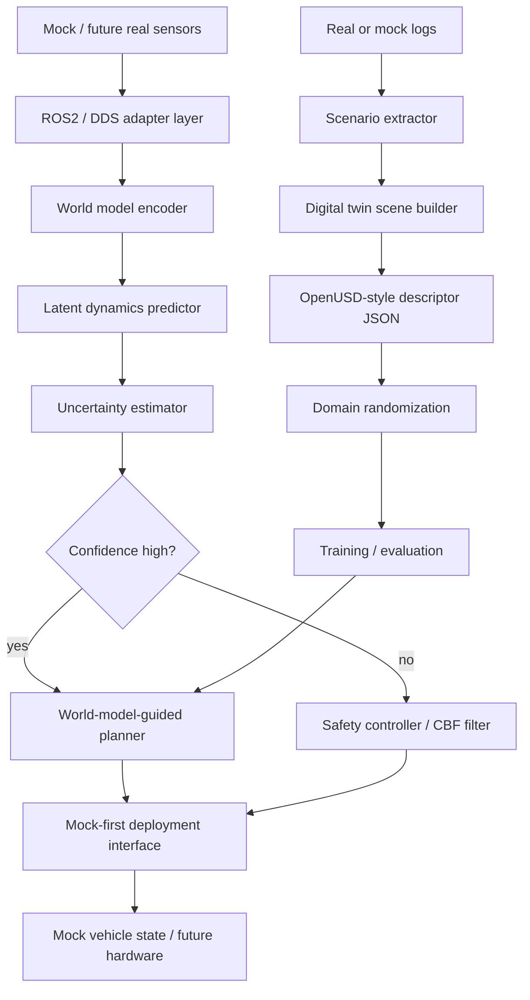

<!-- badges -->


# World-Model-Guided Digital-Twin UAV Navigation Research Framework

> Physical Consistency > Pixel Fidelity

This repository is a mock-first research framework for UAV / UGV / AMR
navigation under sparse rewards. It connects latent world models,
Real2Sim2Real scenario generation, OpenUSD-style digital-twin descriptors,
ROS2 bridge architecture, distributed multi-agent coordination, and safe
deployment-interface primitives.

The code is designed to run and test without GPU, AirSim, ROS2, Isaac Sim,
PX4, ArduPilot, MAVSDK, Nav2, or real hardware.

## Current Status

The latest released checkpoint is `v0.5.0-runtime-readiness`. It captures the
Phase 5 guarded runtime-readiness layer: all normal tests pass locally without
optional robotics runtimes, while real hardware execution and autonomous real
flight remain disabled by default. Phase 6-A is now in progress as a
pure-simulation profile for Isaac Sim / Isaac Lab, ROS2, externally managed
PX4 SITL, MAVSDK, and the GWM safety-gated planning loop.

Completed mock-first and guarded-runtime slices:

| Slice | Status | Key capability |
| --- | --- | --- |
| Phase 1 | Complete | Research-ready modular refactor, mocks, docs, tests |
| Phase 2 | Complete mock-first slice | World-model training, sparse curriculum, Real2Sim2Real pipeline |
| Phase 3-A | Complete mock-first slice | ROS2 bridge and adapter contracts with guarded imports |
| Phase 3-B | Complete mock-first slice | Isaac Sim / OpenUSD-style descriptor builder and JSON export |
| Phase 3-C | Complete mock-first slice | Distributed coordination, DDS-style channel, shared latent map |
| Phase 3-D | Complete mock-first slice | MAVLink, hardware, Nav2-style, and CBF deployment interfaces |
| Phase 4-A | Complete mock-first slice | Generated World Model core |
| Phase 4-B | Complete mock-first slice | Future Frame Projection geometry prior |
| Phase 4-C | Complete guarded-runtime slice | Isaac Sim runtime adapter with fake-backend tests |
| Phase 4-D | Complete mock-first slice | ROS2 image/depth/LiDAR/odom sensor synchronization |
| Phase 4-E | Complete guarded-runtime slice | MAVSDK / PX4 SITL command path |
| Phase 4-F | Complete mock-first slice | End-to-end GWM navigation demo |

The Phase 4 runtime hooks are optional, guarded opt-ins. The repository does
not claim real flight validation, production readiness, automatic PX4 launch,
real Nav2 plugins, real `ros2_control` C++ plugins, or formal safety
certification.

Phase 6-A/6-B/6-C are simulation/SITL-only and do not enable real hardware or
autonomous real flight. Phase 6-B adds a guarded Isaac Sim / Isaac Lab sensor
runtime runner, and Phase 6-C adds a guarded ROS2 simulation sensor bridge.
Both report unavailable runtimes clearly when the required optional stack is not
installed or gated.

## Safety Defaults

The deployment layer is safe by default:

```yaml
deployment:
  mock: true
  sitl_enabled: false
  real_hardware_enabled: false
  autonomous_real_flight_enabled: false
```

Normal tests require no Isaac Sim, ROS2, MAVSDK, PX4, GPU, SITL, or real
hardware. Optional Isaac Sim, ROS2 sensor synchronization, and MAVSDK / PX4
SITL paths require explicit opt-in. `ControlBarrierFunction` is a baseline
runtime filter, not a formal certification proof.

## Architecture



Core package areas:

- `src/world_model/`: latent encoders, dynamics, uncertainty, policy intent.
- `src/rl/`: replay buffer, trainer, sparse curriculum, baseline world model.
- `src/digital_twin/`: scenario extraction, domain randomization, scene descriptors.
- `src/control/`: planner, takeover, safety controller, CBF filter.
- `src/ros2_bridge/`: ROS2 adapter, MAVLink/hardware/Nav2-style mock interfaces.
- `src/multi_agent/`: agent registry, mock DDS, shared maps, swarm coordinator.
- `src/evaluation/`: metrics and sim-to-real gap helpers.

## Quick Start

```bash
python -m venv .venv
.venv\Scripts\activate
pip install -r requirements.txt
python -m pytest tests/ -q
```

The test suite is the main readiness check and must pass without optional
robotics runtimes.

## Script Smoke Commands

```bash
python scripts/train_baseline.py --env mock --max-steps 20
python scripts/train_world_model.py --env mock --model baseline --steps 100
python scripts/train_world_model.py --env mock --model latent --steps 100
python scripts/run_real2sim2real_loop.py --mock --episode-steps 30 --variants 2
python scripts/run_digital_twin_generation.py --num-variations 2
python scripts/train_generated_world_model.py --synthetic --steps 20
python scripts/run_gwm_navigation_demo.py --backend mock --steps 5 --no-write-output
python scripts/check_runtime_capabilities.py --no-write-output
python scripts/run_isaac_sensor_runtime.py --no-write-output
python scripts/run_ros2_sim_sensor_bridge.py --no-write-output
python scripts/evaluate_policy.py --env mock --num-episodes 3
```

Help is available for every script:

```bash
python scripts/train_baseline.py --help
python scripts/train_world_model.py --help
python scripts/run_real2sim2real_loop.py --help
python scripts/run_digital_twin_generation.py --help
python scripts/evaluate_policy.py --help
python scripts/diagnose_airsim.py --help
```

## Documentation

- [Architecture](docs/architecture.md)
- [Paper-style project summary](docs/project_summary.md)
- [v0.4.0 GWM UAV runtime release note](docs/releases/v0.4.0-gwm-uav-runtime.md)
- [v0.3.0 mock-first release note](docs/releases/v0.3.0-mock-first.md)
- [Generated World Model navigation](docs/generated_world_model_navigation.md)
- [Phase 5 runtime validation](docs/phase5_runtime_validation.md)
- [Phase 6 pure-simulation runtime](docs/phase6_pure_simulation_runtime.md)
- [Roadmap](docs/roadmap.md)
- [ROS2 integration](docs/ros2_integration.md)
- [Deployment hardware interface](docs/deployment_hardware_interface.md)
- [Digital twin / Isaac Sim / OpenUSD](docs/digital_twin_isaac_sim_openusd.md)
- [Multi-agent shared world model](docs/multi_agent_shared_world_model.md)
- [Real2Sim2Real pipeline](docs/real2sim2real_pipeline.md)
- [Sparse rewards](docs/sparse_rewards.md)

## Citation / Research Direction

```bibtex
@software{gwm_uav_nav_2026,
  title   = {World-Model-Guided Digital-Twin UAV Navigation Research Framework},
  author  = {Neura-Shadow},
  year    = {2026},
  url     = {https://github.com/Neura-Shadow/GWM-UAV-Navigation-Sparse-Rewards},
  note    = {Sparse-reward navigation via latent world models, asymmetric control,
             Real2Sim2Real data engines, and mock-first deployment interfaces}
}
```
