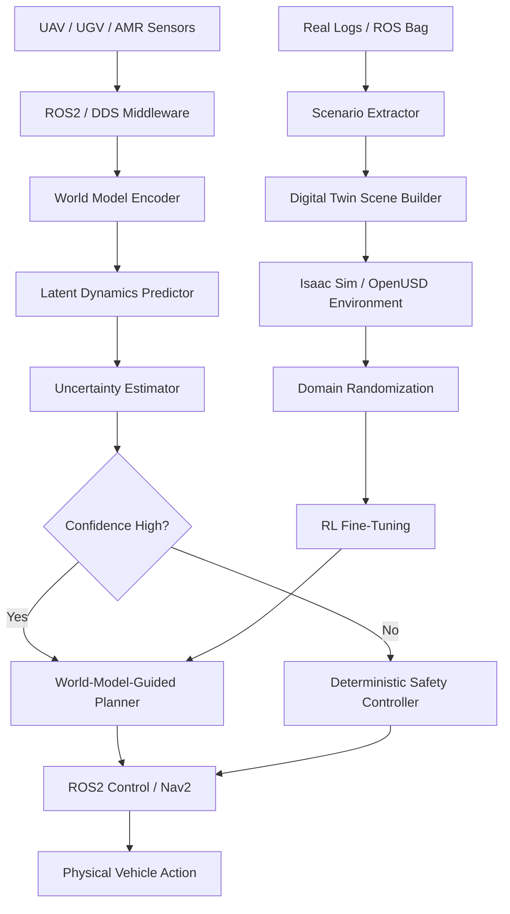

<!-- badges -->


# World-Model-Guided Digital-Twin UAV Navigation Research Framework

> **Physical Consistency > Pixel Fidelity**
>
> A research framework for training autonomous UAV (and multi-robot) navigation policies using latent world models, digital-twin simulation, and Real2Sim2Real data engines — designed to operate under **sparse rewards** without reward shaping.

---

## Project Vision

Autonomous navigation in unstructured 3D environments remains an open challenge.  Conventional approaches either rely on hand-crafted reward functions that do not generalise, or on end-to-end learned policies that lack safety guarantees.  This framework explores a middle path: **world-model-guided planning** — where a learned latent dynamics model imagines future states, quantifies its own uncertainty, and hands off to a deterministic safety controller when confidence is low.

The framework is built around the principle that **a robot does not need a photorealistic digital twin to act intelligently**.  What it needs is a *physically consistent* internal model that captures causal dynamics — how obstacles move, how wind affects trajectory, how actions lead to outcomes.  A compact latent world model trained on real and simulated data can provide this at a fraction of the computational cost of a full physics simulation.

To bridge the persistent sim-to-real gap, the framework implements a **Real2Sim2Real data engine** that continuously extracts challenging real-world scenarios, reconstructs them as digital-twin environments, applies domain randomization, and fine-tunes the policy in simulation before redeploying.  This closed loop ensures the policy improves from every real-world flight.

---

## Why Sparse Rewards Matter

Dense reward shaping (e.g., distance-to-goal at every step) introduces human bias, requires per-task engineering, and often leads to reward hacking.  **Sparse rewards** — a single +1 for reaching the goal, 0 otherwise — force the agent to discover its own strategy, but they make exploration exponentially harder.

This framework tackles sparse rewards through:

- **World-model imagination**: the agent can *predict* whether a candidate trajectory will reach the goal, even before executing it.
- **Uncertainty-driven exploration**: high-uncertainty regions are intrinsically interesting, providing a natural exploration bonus.
- **Curriculum via domain randomization**: progressively harder scenarios guide the agent from easy to difficult goals.

---

## Why World Models Matter

> *Physical Consistency > Pixel Fidelity*

A world model is a learned simulator inside the agent's head.  It compresses raw observations into a latent state, predicts how that state will evolve under different actions, and estimates how confident those predictions are.

| Benefit | Description |
|---------|-------------|
| **Sample efficiency** | Plan in imagination instead of costly real-world rollouts |
| **Uncertainty quantification** | Know when you don't know — trigger safety fallbacks |
| **Causal reasoning** | Predict consequences of actions, not just correlations |
| **Transfer** | Latent dynamics transfer better across visual domains than pixel-level policies |

---

## Why Digital Twin / Isaac Sim / OpenUSD Matter

> *Generative Environment Proxy*

The digital twin is not a static replica — it is a **generative engine** that produces diverse training environments from compact scene specifications.

- **Isaac Sim** provides GPU-accelerated physics (PhysX) and photorealistic rendering.
- **OpenUSD** enables composable, versionable scene descriptions.
- **Domain randomization** in Isaac Sim produces unlimited environment variants.
- **Real2Sim2Real** closes the loop: real scenarios → sim training → real deployment.

The framework uses an **adapter pattern** so that Isaac Sim is optional — all development and testing works with a mock backend.

---

## Why ROS2 Matters

> *Real-time Control, DDS Middleware*

ROS2 provides the deterministic, real-time communication layer required for safety-critical robotics:

- **DDS middleware** with configurable QoS for reliable or best-effort delivery.
- **ros2_control** for deterministic actuator control at 200+ Hz.
- **Nav2** for ground vehicle navigation with costmap integration.
- **Lifecycle nodes** for managed startup/shutdown.

The framework wraps all ROS2 interactions behind a mock adapter, enabling development without a ROS2 installation.

---

## System Architecture



| Layer | Core Technology | Role |
|-------|----------------|------|
| **Cognitive / Imagination** | World Model | Causal reasoning, planning, future prediction |
| **Spatiotemporal Environment** | Digital Twin / Isaac Sim / OpenUSD | Simulation, synthetic data, physics-consistent environment |
| **Middleware / Control** | ROS2 / DDS / ros2_control | Communication, scheduling, deterministic control |
| **Physical Embodiment** | UAV / UGV / AMR | Real-world execution and validation |

See [docs/architecture.md](docs/architecture.md) for the full architecture breakdown.

---

## Four Research Axes

### Axis 1: Latent World Model instead of Pure Geometric Digital Twin

Replace static geometric twins with a learned latent dynamics model that enables imagination-based planning and uncertainty quantification.

→ [Full details](docs/research_axes.md#axis-1-latent-world-model-instead-of-pure-geometric-digital-twin)

### Axis 2: Asymmetric Control (Brain vs Cerebellum)

Separate slow deliberative planning (world model) from fast reflexive safety control (deterministic controller), with the safety layer always having override authority.

→ [Full details](docs/research_axes.md#axis-2-asymmetric-control-between-world-model-brain-and-ros2-cerebellum)

### Axis 3: Real2Sim2Real Digital Twin Data Engine

Continuously extract real-world challenges, reproduce them in simulation with domain randomization, and fine-tune policies before redeployment.

→ [Full details](docs/research_axes.md#axis-3-real2sim2real-digital-twin-data-engine)

### Axis 4: Multi-Agent Shared World Model

Enable fleet-scale coordination through a shared 4D spatiotemporal latent map that agents contribute to and plan over collectively.

→ [Full details](docs/research_axes.md#axis-4-multi-agent-shared-world-model)

---

## Repository Structure

```
GWM-UAV-Navigation-Sparse-Rewards/
├── README.md                               # This file
├── main.py                                 # Legacy entry point
│
├── src/                                    # Core source code
│   ├── __init__.py
│   ├── world_model/                        # Latent dynamics, encoder, uncertainty
│   │   └── __init__.py
│   ├── env/                                # Environment wrappers (mock, AirSim)
│   │   └── __init__.py
│   ├── rl/                                 # Reinforcement learning agents
│   │   └── __init__.py
│   ├── control/                            # Safety controller, takeover logic
│   │   └── __init__.py
│   ├── digital_twin/                       # Scene builder, domain randomization
│   │   └── __init__.py
│   ├── ros2_bridge/                        # ROS2 adapter (mock / rclpy)
│   │   └── __init__.py
│   ├── multi_agent/                        # Shared map, fleet coordination
│   │   └── __init__.py
│   ├── evaluation/                         # Metrics tracker, evaluation tools
│   │   ├── __init__.py
│   │   └── metrics.py
│   └── utils/                              # Config loading, logging utilities
│       └── __init__.py
│
├── scripts/                                # Runnable entry points
│   ├── train_world_model.py                # World model pre-training
│   ├── evaluate_policy.py                  # Policy evaluation with metrics
│   ├── run_real2sim2real_loop.py            # Real2Sim2Real data engine
│   └── run_digital_twin_generation.py      # Scene generation + randomization
│
├── configs/                                # Configuration files
│   └── airsim/                             # AirSim-specific settings
│
├── examples/                               # Example scenario configs
│   ├── single_uav_navigation.yaml          # Single UAV with obstacles
│   ├── corner_case_slip.yaml               # Wind + friction corner case
│   └── multi_agent_swarm.yaml              # 4-UAV swarm navigation
│
├── docs/                                   # Documentation
│   ├── architecture.md                     # System architecture
│   ├── research_axes.md                    # Four research axes
│   ├── real2sim2real_pipeline.md            # R2S2R pipeline details
│   ├── ros2_integration.md                 # ROS2 integration guide
│   ├── digital_twin_isaac_sim_openusd.md   # Isaac Sim / OpenUSD guide
│   ├── multi_agent_shared_world_model.md   # Multi-agent architecture
│   └── roadmap.md                          # Development roadmap
│
├── tests/                                  # Test suite
├── tools/                                  # Development tools
├── legacy/                                 # Archived legacy code
└── references/                             # Reference papers and materials
```

---

## Quick Start

### Installation

```bash
# Clone the repository
git clone https://github.com/Neura-Shadow/GWM-UAV-Navigation-Sparse-Rewards.git
cd GWM-UAV-Navigation-Sparse-Rewards

# Create a virtual environment (Python 3.10+)
python -m venv .venv
.venv\Scripts\activate        # Windows
# source .venv/bin/activate   # Linux / macOS

# Install core dependencies
pip install torch numpy pyyaml

# Verify the installation
python -c "from src.evaluation.metrics import MetricsTracker; print('OK')"
```

### Run Mock Policy Evaluation

```bash
# Evaluate a random policy for 50 episodes in mock environment
python scripts/evaluate_policy.py --num-episodes 50 --env mock --output outputs/metrics.json
```

### Run Script Help

```bash
python scripts/train_world_model.py --help
python scripts/run_real2sim2real_loop.py --help
python scripts/run_digital_twin_generation.py --help
python scripts/evaluate_policy.py --help
```

### Run Tests

```bash
# Run all tests (no GPU / AirSim / ROS2 required)
python -m pytest tests/ -v
```

---

## Current Status

**Phase 1: Research-Ready Refactor** is complete.  All interfaces are defined, mock implementations are in place, and the full stack can be developed and tested on any machine without GPU, AirSim, ROS2, or Isaac Sim.

Key deliverables:
- ✅ Modular source structure with abstract interfaces
- ✅ Mock adapters for all external dependencies
- ✅ Evaluation metrics with sim-to-real gap tracking
- ✅ Example configurations for single-agent, corner-case, and multi-agent scenarios
- ✅ Placeholder scripts with full `--help` documentation
- ✅ Comprehensive architecture and research documentation

---

## Roadmap

| Phase | Status | Key Milestone |
|-------|--------|--------------|
| **Phase 1**: Research-Ready Refactor | ✅ Complete | Interfaces, mocks, documentation |
| **Phase 2**: Simulation-Driven Training | 🔲 In Progress | World model training, RL fine-tuning, R2S2R loop |
| **Phase 3**: ROS2 / Isaac Sim / Multi-Agent | 🔲 Planned | Real deployment, swarm coordination |

→ [Full roadmap with checkboxes](docs/roadmap.md)

---

## Citation / Research Direction

If you use this framework in your research, please cite:

```bibtex
@software{gwm_uav_nav_2026,
  title   = {World-Model-Guided Digital-Twin UAV Navigation
             Research Framework},
  author  = {Neura-Shadow},
  year    = {2026},
  url     = {https://github.com/Neura-Shadow/GWM-UAV-Navigation-Sparse-Rewards},
  note    = {Sparse-reward navigation via latent world models,
             asymmetric control, and Real2Sim2Real data engines}
}
```

### Key References

- Ha & Schmidhuber, *World Models* (2018) — Learned environment models for planning.
- Hafner et al., *DreamerV3* (2023) — World model–based RL across diverse domains.
- Tobin et al., *Domain Randomization for Sim2Real Transfer* (2017) — Randomised simulation for robust transfer.
- NVIDIA Isaac Sim — GPU-accelerated robotics simulation.
- Open Robotics ROS2 — Real-time robotics middleware.

---

<p align="center">
  <em>Built for research. Designed for reality.</em>
</p>
