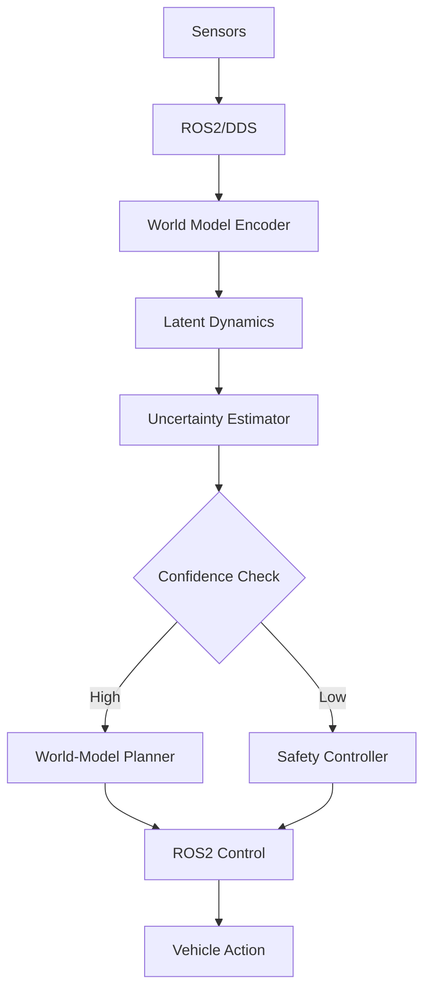
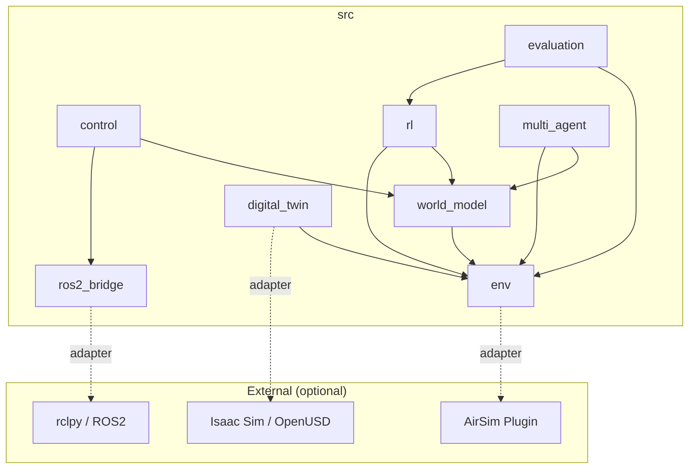

# System Architecture

## Overview

The **World-Model-Guided Digital-Twin UAV Navigation Research Framework** is organised as a four-layer architecture that cleanly separates *cognitive reasoning* from *physical actuation*.  A latent world model sits at the top, predicting future states and quantifying uncertainty.  Below it, a digital-twin simulation layer provides physics-consistent environments for training and domain randomization.  A deterministic ROS2/DDS middleware handles real-time communication and scheduling.  At the base, physical vehicles (UAV / UGV / AMR) execute actions in the real world.

This layered design enables a strict **adapter pattern**: every external dependency (AirSim, Isaac Sim, ROS2) is accessed through an abstract interface with a mock implementation, so the entire cognitive stack can be developed, tested, and iterated without any hardware or licensed simulator.

---

## Four-Layer Architecture

| Layer | Core Technology | Role |
|-------|----------------|------|
| **Cognitive / Imagination Layer** | World Model (Latent Dynamics + Uncertainty) | Causal reasoning, long-horizon planning, future state prediction |
| **Spatiotemporal Environment Layer** | Digital Twin / Isaac Sim / OpenUSD | High-fidelity simulation, synthetic data generation, physics-consistent environment |
| **Middleware / Control Layer** | ROS2 / DDS / `ros2_control` | Real-time communication, deterministic scheduling, sensor fusion |
| **Physical Embodiment Layer** | UAV / UGV / AMR | Real-world execution, sensor capture, and validation |

---

## Data Flow

The following diagram shows how sensor data flows through the system, from raw observations to physical vehicle actions.



### Flow description

1. **Sensors → ROS2/DDS** — Raw observations (LiDAR, IMU, camera, GPS) are published on DDS topics with deterministic QoS.
2. **ROS2/DDS → World Model Encoder** — The encoder compresses high-dimensional observations into a compact latent state vector.
3. **Latent Dynamics** — The dynamics module predicts future latent states given the current state and candidate actions.
4. **Uncertainty Estimator** — An ensemble or dropout-based estimator quantifies epistemic uncertainty over predicted futures.
5. **Confidence Check** — If uncertainty is below a threshold the world-model planner selects the best imagined trajectory; otherwise control falls back to a deterministic safety controller.
6. **ROS2 Control → Vehicle Action** — The chosen velocity or waypoint command is sent through `ros2_control` to the flight controller.

---

## Module Dependency Diagram



All dashed arrows indicate **optional adapter connections**.  The core source tree (`src/`) never hard-imports any external dependency; instead each module defines an abstract base class and provides a mock implementation.

---

## Asymmetric Control: Brain vs Cerebellum

The framework implements an **asymmetric actor** design inspired by neuroscience:

| Component | Analogy | Responsibility | Latency |
|-----------|---------|---------------|---------|
| **World Model Planner** | Brain | Long-horizon imagination, trajectory optimisation | ~50–200 ms |
| **Safety Controller** | Cerebellum | Reflexive collision avoidance, geofence enforcement | < 5 ms |

The *Brain* (world model) runs at a slower cadence, producing multi-step action plans.  The *Cerebellum* (safety controller) operates at the ROS2 control loop frequency and can override the Brain's commands instantly when:

- Obstacle distance drops below the safety threshold.
- Uncertainty exceeds the configured confidence bound.
- Communication with the planner is lost (heartbeat timeout).

This separation guarantees that the vehicle remains safe even when the world model is uncertain, slow, or temporarily unavailable.

---

## Adapter Pattern for Optional Dependencies

Every external system is wrapped behind an **abstract interface** (Python ABC):

```
┌──────────────────────┐     ┌───────────────────────────┐
│  AbstractROS2Adapter │────▶│  MockROS2Adapter (default) │
│                      │     └───────────────────────────┘
│  publish()           │     ┌───────────────────────────┐
│  subscribe()         │────▶│  RealROS2Adapter (rclpy)   │
│  spin()              │     └───────────────────────────┘
└──────────────────────┘
```

The same pattern is applied to:

- **Environment**: `MockEnv` vs `AirSimEnv`
- **Digital Twin**: `MockSceneBuilder` vs `IsaacSimSceneBuilder`
- **ROS2 Bridge**: `MockROS2Adapter` vs `RealROS2Adapter`

Switching between mock and real is controlled by a single `type` field in the YAML configuration:

```yaml
env:
  type: "mock"      # or "airsim"

ros2:
  type: "mock"      # or "rclpy"

digital_twin:
  type: "mock"      # or "isaac_sim"
```

This design ensures that **all modules are importable and testable on any machine** without GPU, simulator, or ROS2 installed.
