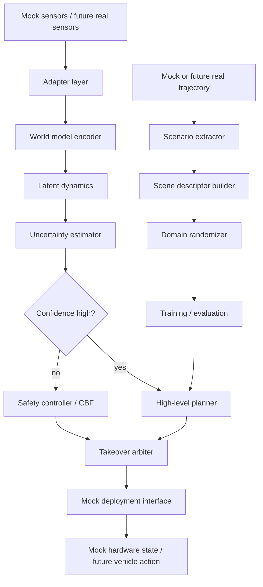

# System Architecture

## Overview

The World-Model-Guided Digital-Twin UAV Navigation Research Framework is a
mock-first robotics research stack. It separates cognitive planning, digital
twin generation, middleware abstractions, multi-agent coordination, and
deployment safety interfaces while keeping every required test runnable without
optional robotics runtimes.

## Layers

| Layer | Current implementation | Future runtime path |
| --- | --- | --- |
| World model | Trainable baseline and latent models | Larger datasets and onboard profiling |
| Digital twin | JSON and OpenUSD-style descriptors | Isaac Sim / OpenUSD runtime generation |
| Control | Planner, takeover, safety controller, CBF filter | Certified safety and timing validation |
| ROS2 / DDS | Guarded ROS2 bridge, mock adapter, mock DDS channel | Real ROS2 nodes and DDS runtime validation |
| Multi-agent | Shared maps and deterministic coordination | Decentralized consensus and large fleets |
| Deployment | Mock MAVLink, hardware, Nav2-style interfaces | SITL/HIL and real hardware validation |

## Data Flow



## Adapter Pattern

External systems are represented by narrow interfaces and mock-first
implementations:

- ROS2: `ROS2Adapter`, `MockROS2Adapter`, `ROS2Bridge`, `RealROS2Adapter`
- Digital twin: `SimSceneBuilder`, `IsaacSimSceneBuilder`, `MockUSDStage`
- Multi-agent: `MockDDSChannel`, `ROS2DDSChannel`
- Deployment: `MAVLinkBridge`, `HardwareInterface`, `MockHardwareInterface`

Guarded real paths raise clear `RuntimeError` messages when optional
dependencies are missing. Importing the project does not require ROS2, Isaac
Sim, PX4, ArduPilot, MAVSDK, Nav2, GPU, or real hardware.

## Safety Boundary

Deployment defaults remain safe:

```yaml
deployment:
  mock: true
  real_hardware_enabled: false
  autonomous_real_flight_enabled: false
```

The CBF module is a baseline runtime safety filter. It is not a formal
certification proof. Real hardware flight, real `ros2_control` plugins, real
Nav2 plugins, SITL/HIL launch automation, and certification evidence remain
future work.
