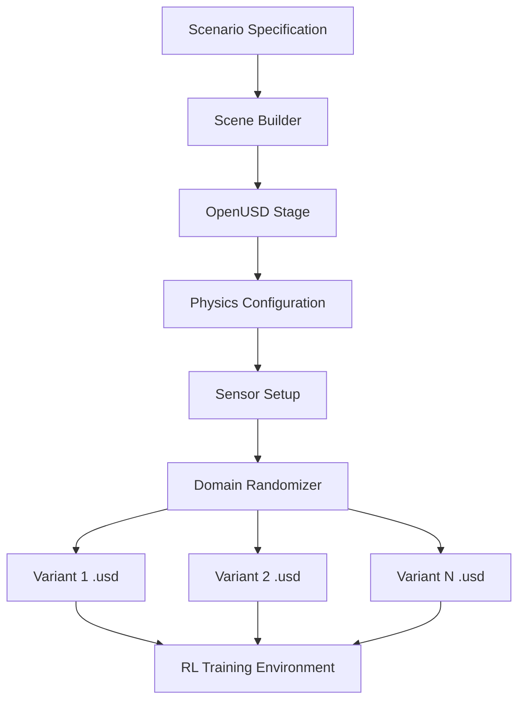
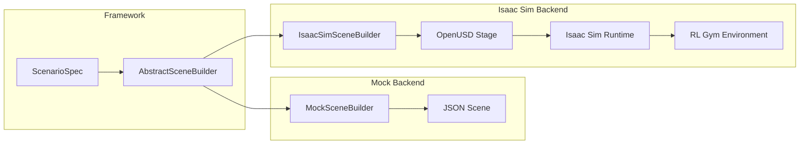

# Digital Twin with Isaac Sim and OpenUSD

## Vision

The digital twin layer serves as a **generative environment proxy** — a physics-consistent, photorealistic simulation that can produce unlimited training scenarios from a compact scene specification.  By leveraging NVIDIA Isaac Sim and the OpenUSD scene format, we aim to:

1. Generate high-fidelity environments that mirror real-world deployment sites.
2. Apply systematic domain randomization to improve sim-to-real transfer.
3. Enable photorealistic rendering for visual policy training.
4. Support multi-agent simulation with deterministic physics.

The key insight is: **the digital twin is not a static replica — it is a generative engine** that produces diverse training environments from real-world scenarios.

---

## Isaac Sim Scene Generation Pipeline



### Pipeline stages

1. **Scenario Specification** — A YAML file describing obstacles, goals, physics params, and randomization ranges.
2. **Scene Builder** — Translates the specification into an OpenUSD stage with prims for each obstacle, the ground plane, and the vehicle.
3. **Physics Configuration** — Sets up PhysX parameters: gravity, friction materials, aerodynamic drag coefficients.
4. **Sensor Setup** — Attaches simulated sensors (LiDAR, depth camera, IMU) to the vehicle prim.
5. **Domain Randomizer** — Applies Isaac Sim's built-in randomization to produce N distinct environment variants.

---

## OpenUSD Scene Format

[OpenUSD](https://openusd.org/) (Universal Scene Description) is the standard scene format used by Isaac Sim and Omniverse.  Key concepts:

| Concept | Description |
|---------|-------------|
| **Stage** | The root container for a scene (`.usd` / `.usda` / `.usdc` file) |
| **Prim** | A scene element (mesh, xform, camera, physics body) |
| **Property** | Attributes and relationships on prims |
| **Layer** | Composable scene overrides (used for domain randomization) |
| **Variant Set** | Named alternatives for a prim (e.g., different obstacle textures) |

A typical scene hierarchy:

```
/World
  /GroundPlane
  /Obstacles
    /Obstacle_0  (Sphere, radius=3.0, position=[30,10,-8])
    /Obstacle_1  (Sphere, radius=2.0, position=[45,15,-6])
  /Vehicle
    /UAV
      /Sensors
        /LiDAR
        /DepthCamera
        /IMU
  /Goal  (Xform, position=[60,20,-8])
```

---

## Scene Specification Format (Our YAML/JSON)

Our framework uses a simplified YAML format that is translated into OpenUSD by the scene builder:

```yaml
scene:
  name: "warehouse_nav"
  ground:
    type: "plane"
    size: [200.0, 200.0]
    friction: 0.8

  obstacles:
    - type: "sphere"
      position: [30.0, 10.0, -8.0]
      radius: 3.0
      material: "concrete"
    - type: "box"
      position: [45.0, 15.0, -6.0]
      size: [2.0, 2.0, 4.0]
      material: "metal"

  vehicle:
    type: "uav"
    start_position: [0.0, 0.0, -5.0]
    sensors:
      - type: "lidar"
        range: 50.0
        fov: 360.0
      - type: "depth_camera"
        resolution: [640, 480]
        fov: 90.0

  goal:
    position: [60.0, 20.0, -8.0]
    reach_radius: 3.0

  physics:
    gravity: [0.0, 0.0, -9.81]
    wind: [0.0, 0.0, 0.0]
    time_step: 0.01
```

---

## Domain Randomization in Isaac Sim

Isaac Sim provides native support for domain randomization through its Replicator API.  We plan to randomise:

### Geometry randomization
- Obstacle positions: uniform noise within ± N metres
- Obstacle sizes: scale factor 0.8–1.2×
- Additional distractor objects

### Physics randomization
- Wind speed and direction
- Surface friction coefficients
- Vehicle mass and drag coefficients
- Motor response latency

### Visual randomization (for RGB policies)
- Texture randomization on all surfaces
- Lighting direction, intensity, and colour temperature
- Sky / background HDR maps
- Camera noise and lens distortion

### Sensor randomization
- LiDAR noise standard deviation
- Depth camera dropout probability
- IMU bias and drift rates

Each randomization parameter is specified as a range in the scenario YAML.  The domain randomizer samples uniformly (or from a configured distribution) within these ranges to produce each variant.

---

## Current Implementation: Mock Scene Builder

The current `MockSceneBuilder` provides a functional stand-in that:

- Parses the scenario YAML / `ScenarioSpec` dataclass.
- Generates scene data as a Python dictionary or JSON file.
- Supports obstacle placement with position noise for basic domain randomization.
- Does **not** produce OpenUSD files or connect to Isaac Sim.

This allows the full pipeline to be developed and tested without an NVIDIA GPU or Isaac Sim licence.

```python
# Usage example
from src.digital_twin.scene_builder import MockSceneBuilder

builder = MockSceneBuilder()
scene = builder.build_from_spec(scenario_spec)
builder.export_json(scene, "outputs/scenes/scene_001.json")
```

---

## Future Integration Plan

### Phase 2: Isaac Sim Connection

1. Implement `IsaacSimSceneBuilder` that creates OpenUSD stages programmatically using the `omni.isaac.core` API.
2. Connect to a headless Isaac Sim instance for batch scene generation.
3. Use Replicator for domain randomization.

### Phase 3: Full Pipeline

1. Bidirectional sync between the latent world model and the Isaac Sim environment.
2. Real-time digital twin mirroring: update the OpenUSD scene from live sensor data.
3. Multi-agent simulation with PhysX-based inter-agent collision detection.
4. Photorealistic synthetic data generation for visual policy pre-training.

### Integration architecture



The adapter pattern ensures that switching from mock to Isaac Sim requires only a configuration change:

```yaml
digital_twin:
  type: "isaac_sim"  # was "mock"
  isaac_sim:
    headless: true
    gpu_id: 0
```
