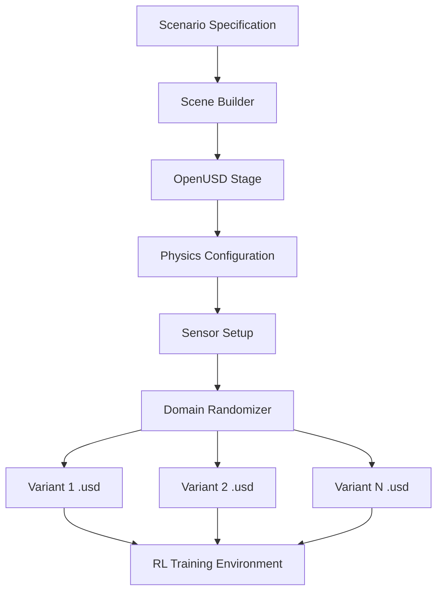
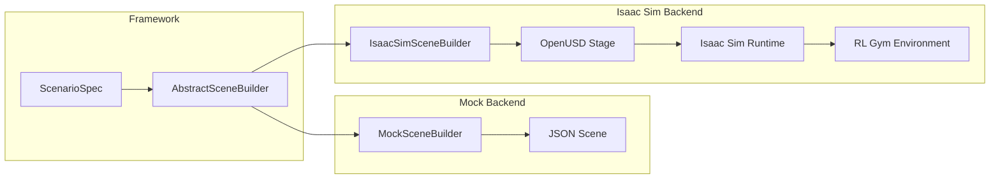

# Digital Twin with Isaac Sim and OpenUSD

## Vision

The digital twin layer serves as a **generative environment proxy** — a physics-consistent, photorealistic simulation that can produce unlimited training scenarios from a compact scene specification.  By leveraging NVIDIA Isaac Sim and the OpenUSD scene format, we aim to:

1. Generate high-fidelity environments that mirror real-world deployment sites.
2. Apply systematic domain randomization to improve sim-to-real transfer.
3. Enable photorealistic rendering for visual policy training.
4. Support multi-agent simulation with deterministic physics.

The key insight is: **the digital twin is not a static replica — it is a generative engine** that produces diverse training environments from real-world scenarios.

---

## Isaac Sim Scene Generation Pipeline



### Pipeline stages

1. **Scenario Specification** — A YAML file describing obstacles, goals, physics params, and randomization ranges.
2. **Scene Builder** — Translates the specification into an OpenUSD stage with prims for each obstacle, the ground plane, and the vehicle.
3. **Physics Configuration** — Sets up PhysX parameters: gravity, friction materials, aerodynamic drag coefficients.
4. **Sensor Setup** — Attaches simulated sensors (LiDAR, depth camera, IMU) to the vehicle prim.
5. **Domain Randomizer** — Applies Isaac Sim's built-in randomization to produce N distinct environment variants.

---

## OpenUSD Scene Format

[OpenUSD](https://openusd.org/) (Universal Scene Description) is the standard scene format used by Isaac Sim and Omniverse.  Key concepts:

| Concept | Description |
|---------|-------------|
| **Stage** | The root container for a scene (`.usd` / `.usda` / `.usdc` file) |
| **Prim** | A scene element (mesh, xform, camera, physics body) |
| **Property** | Attributes and relationships on prims |
| **Layer** | Composable scene overrides (used for domain randomization) |
| **Variant Set** | Named alternatives for a prim (e.g., different obstacle textures) |

A typical scene hierarchy:

```
/World
  /GroundPlane
  /Obstacles
    /Obstacle_0  (Sphere, radius=3.0, position=[30,10,-8])
    /Obstacle_1  (Sphere, radius=2.0, position=[45,15,-6])
  /Vehicle
    /UAV
      /Sensors
        /LiDAR
        /DepthCamera
        /IMU
  /Goal  (Xform, position=[60,20,-8])
```

---

## Scene Specification Format (Our YAML/JSON)

Our framework uses a simplified YAML format that is translated into OpenUSD by the scene builder:

```yaml
scene:
  name: "warehouse_nav"
  ground:
    type: "plane"
    size: [200.0, 200.0]
    friction: 0.8

  obstacles:
    - type: "sphere"
      position: [30.0, 10.0, -8.0]
      radius: 3.0
      material: "concrete"
    - type: "box"
      position: [45.0, 15.0, -6.0]
      size: [2.0, 2.0, 4.0]
      material: "metal"

  vehicle:
    type: "uav"
    start_position: [0.0, 0.0, -5.0]
    sensors:
      - type: "lidar"
        range: 50.0
        fov: 360.0
      - type: "depth_camera"
        resolution: [640, 480]
        fov: 90.0

  goal:
    position: [60.0, 20.0, -8.0]
    reach_radius: 3.0

  physics:
    gravity: [0.0, 0.0, -9.81]
    wind: [0.0, 0.0, 0.0]
    time_step: 0.01
```

---

## Domain Randomization in Isaac Sim

Isaac Sim provides native support for domain randomization through its Replicator API.  We plan to randomise:

### Geometry randomization
- Obstacle positions: uniform noise within ± N metres
- Obstacle sizes: scale factor 0.8–1.2×
- Additional distractor objects

### Physics randomization
- Wind speed and direction
- Surface friction coefficients
- Vehicle mass and drag coefficients
- Motor response latency

### Visual randomization (for RGB policies)
- Texture randomization on all surfaces
- Lighting direction, intensity, and colour temperature
- Sky / background HDR maps
- Camera noise and lens distortion

### Sensor randomization
- LiDAR noise standard deviation
- Depth camera dropout probability
- IMU bias and drift rates

Each randomization parameter is specified as a range in the scenario YAML.  The domain randomizer samples uniformly (or from a configured distribution) within these ranges to produce each variant.

---

## Current Implementation: Mock-First Scene Builders

The current digital-twin scene layer provides two mock-first builders:

1. `SimSceneBuilder` produces the existing simulator-agnostic JSON/YAML scene
   descriptor.
2. `IsaacSimSceneBuilder` produces an OpenUSD-style descriptor dictionary with
   stable prim paths for `/World`, `/World/GroundPlane`, obstacles, vehicle,
   sensors, and goal.

`IsaacSimSceneBuilder.build(spec)` always works without NVIDIA GPU, Isaac Sim,
or OpenUSD installed. It preserves the project's current coordinate convention
exactly and records the pending Isaac conversion explicitly:

```python
from src.digital_twin import IsaacSimSceneBuilder

builder = IsaacSimSceneBuilder()
descriptor = builder.build(scenario_spec)
builder.export_json(descriptor, "outputs/scenes/scene_001.json")
```

Descriptor metadata includes:

```yaml
source_coordinate_frame: "project_default"
target_coordinate_frame: "isaac_z_up_pending"
coordinate_conversion_applied: false
```

`build_usd_stage(spec, output_path)` is guarded and raises a clear
`RuntimeError` when Isaac Sim / OpenUSD Python APIs are unavailable. Phase 3-B
exports descriptor JSON first; real `.usd` / `.usda` generation remains an
optional later step.

Switching builders is done through the factory:

```python
from src.digital_twin import SimSceneBuilder

mock_builder = SimSceneBuilder.create(backend="mock")
isaac_descriptor_builder = SimSceneBuilder.create(backend="isaac_sim")
```

---

## Guarded Isaac Sim Runtime

Phase 4-C adds two import-safe runtime interfaces:

- `IsaacSimRuntime` in `src.digital_twin`
- `IsaacSimNavigationEnv` in `src.env`

Normal tests inject a fake backend and do not require Isaac Sim, OpenUSD, GPU,
ROS2, MAVSDK, PX4, Nav2, or Replicator. The runtime imports Isaac Sim only
inside guarded lifecycle helpers such as `launch()`.

```python
from src.digital_twin import IsaacSimRuntime
from src.env import IsaacSimNavigationEnv

runtime = IsaacSimRuntime(backend=fake_or_real_backend)
env = IsaacSimNavigationEnv(descriptor=descriptor, runtime=runtime)
obs = env.reset()
obs, reward, done, info = env.step([1.0, 0.0, 0.0])
env.close()
```

`IsaacSimRuntime.load_descriptor()` accepts descriptor dictionaries, descriptor
JSON paths, and guarded `.usd` / `.usda` / `.usdc` stage references. Actual USD
stage opening remains optional and occurs only when launched from an Isaac Sim
Python environment.

Sensor snapshots are normalized into `SensorObservation`:

- RGB or image data -> `image`
- Depth map -> `depth`
- LiDAR point cloud -> `lidar`
- IMU payload -> `metadata["imu"]`
- pose, velocity, goal distance, and obstacle distance -> state-vector fields

Coordinate conversion remains intentionally pending. Runtime metadata preserves:

```yaml
source_coordinate_frame: "project_default"
target_coordinate_frame: "isaac_z_up_pending"
coordinate_conversion_applied: false
```

## Future Integration Plan

1. Add audited project-to-Isaac Z-up coordinate conversion.
2. Add real OpenUSD stage generation and richer sensor extraction when Isaac
   Sim / OpenUSD APIs are installed.
3. Use Replicator for domain randomization.
4. Add bidirectional sync between the latent world model and the Isaac Sim
   environment.
5. Add real-time digital twin mirroring and multi-agent simulation.

### Integration architecture



The adapter pattern lets callers select the mock scene builder or the
Isaac/OpenUSD-style descriptor builder through configuration. Optional Isaac Sim
runtime execution requires the installed Isaac Sim / OpenUSD Python APIs:

```yaml
digital_twin:
  type: "isaac_sim"  # was "mock"
  isaac_runtime:
    enabled: false
    headless: true
    launch_mode: "mock_or_connect"
```
