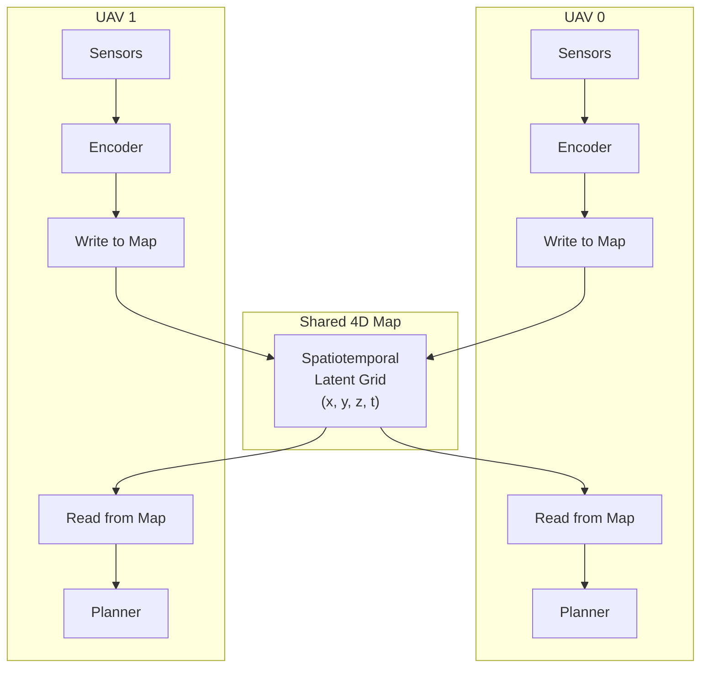

# Multi-Agent Shared World Model

## Overview

When multiple autonomous vehicles operate in the same environment, each agent builds its own internal model of the world.  These independent models are redundant, incomplete, and can lead to conflicting plans.  The **shared world model** addresses this by maintaining a single, distributed spatiotemporal representation that all agents contribute to and query from.

The core idea: **each agent sees a fragment; together they see the whole**.

---

## Shared World Model Concept



Each agent:

1. **Encodes** its local observations into latent features.
2. **Writes** those features to the shared map at its current position.
3. **Reads** map features for regions it is planning to traverse.
4. **Plans** in latent space, accounting for other agents' reserved paths.

---

## 4D Spatiotemporal Map

The map is a voxel grid with dimensions `(X, Y, Z, T)`:

| Dimension | Description | Typical Resolution |
|-----------|-------------|--------------------|
| X, Y, Z | Spatial position (metres) | 1–2 m per cell |
| T | Time into the future (seconds) | 0.5–1.0 s per step |

Each cell stores:

- **Latent feature** `z ∈ ℝ^d` — compressed representation of what is known about that region.
- **Occupancy probability** `p ∈ [0, 1]` — likelihood of an obstacle or another agent.
- **Confidence** `c ∈ [0, 1]` — how recently and reliably the cell was observed.
- **Reservation flag** — which agent (if any) has reserved this cell for a future time-step.

### Map operations

| Operation | Description |
|-----------|-------------|
| `write(x, y, z, t, feature)` | Update a cell with a new latent observation |
| `read(x, y, z, t)` → feature | Query the latent state of a cell |
| `reserve(x, y, z, t, agent_id)` | Reserve a cell for an agent's planned path |
| `decay(dt)` | Reduce confidence of all cells by time-decay factor |

---

## Agent State Management

Each agent broadcasts its state at regular intervals:

```python
@dataclass
class AgentState:
    agent_id: str
    position: Tuple[float, float, float]
    velocity: Tuple[float, float, float]
    heading: float                          # radians
    uncertainty: float                      # current model uncertainty
    planned_path: List[Tuple[float, ...]]   # future waypoints
    timestamp: float                        # seconds since epoch
```

The fleet coordinator maintains a registry of all agent states and detects conflicts (two agents planning to occupy the same cell at the same time).

---

## Communication via DDS QoS

Multi-agent communication uses DDS (the default middleware for ROS2) with carefully configured QoS:

| Topic | QoS Profile | Rate | Purpose |
|-------|-------------|------|---------|
| `/fleet/agent_state` | Reliable, Transient Local | 2 Hz | State broadcast |
| `/fleet/map_update` | Reliable, Transient Local | 5 Hz | Shared map deltas |
| `/fleet/conflict_alert` | Reliable, Keep Last 10 | Event | Conflict notifications |
| `/fleet/coordination` | Reliable, Keep All | Event | Slot assignments |

Key QoS decisions:

- **Transient Local durability** ensures late-joining agents receive the most recent state.
- **Reliable reliability** guarantees no dropped coordination messages.
- **Map updates are delta-compressed** — only changed cells are transmitted.

---

## Swarm Coordination Strategies

The `FleetCoordinator` supports pluggable coordination strategies:

### Round-Robin

Each agent is assigned a fixed time-slot for path execution.  Simple, fair, but may not utilise bandwidth optimally.

```
Time slot 0: UAV_0 plans and moves
Time slot 1: UAV_1 plans and moves
Time slot 2: UAV_2 plans and moves
...
```

### Priority-Based

Agents are assigned priorities based on:
- Distance to goal (closer = higher priority)
- Remaining battery
- Uncertainty level (more certain = higher priority)

Higher-priority agents plan first; lower-priority agents plan around them.

### Consensus-Based (Future)

Agents negotiate paths through a decentralised consensus protocol.  No central coordinator required.  More complex but scales better to large fleets.

---

## Current Implementation

| Component | Status | Location |
|-----------|--------|----------|
| `AgentState` dataclass | ✅ Stub | `src/multi_agent/` |
| `SharedSpatiotemporalMap` | ✅ Stub | `src/multi_agent/` |
| `FleetCoordinator` | ✅ Stub | `src/multi_agent/` |
| DDS communication | 🔲 Mock only | `src/ros2_bridge/` |
| Conflict detection | 🔲 Planned | `src/multi_agent/` |
| Multi-agent evaluation metrics | ✅ In `EpisodeMetrics` | `src/evaluation/metrics.py` |
| Example config | ✅ Complete | `examples/multi_agent_swarm.yaml` |

---

## Future Directions

### UAV Swarm (4–16 agents)

- Cooperative exploration: divide environment into regions for parallel mapping.
- Formation flying: maintain geometric formation while navigating through obstacles.
- Relay communication: extend operational range by forming ad-hoc mesh networks.

### AMR Fleet (Warehouse / Logistics)

- Shared occupancy grid for narrow-aisle navigation.
- Task allocation: assign delivery tasks to minimise total fleet travel time.
- Charging coordination: schedule recharging without starving active tasks.

### Heterogeneous Fleets (UAV + UGV)

- UAV scouts provide aerial reconnaissance and map updates.
- UGV ground vehicles execute tasks using UAV-provided maps.
- Cross-platform latent feature alignment for heterogeneous encoders.

### Scalability Research

- **4 agents** — Current target (Phase 2).
- **16 agents** — Test coordination strategy scaling.
- **64+ agents** — Requires decentralised consensus; centralised coordinator becomes bottleneck.
- Investigate hierarchical coordination: cluster agents into squads with local coordinators.
