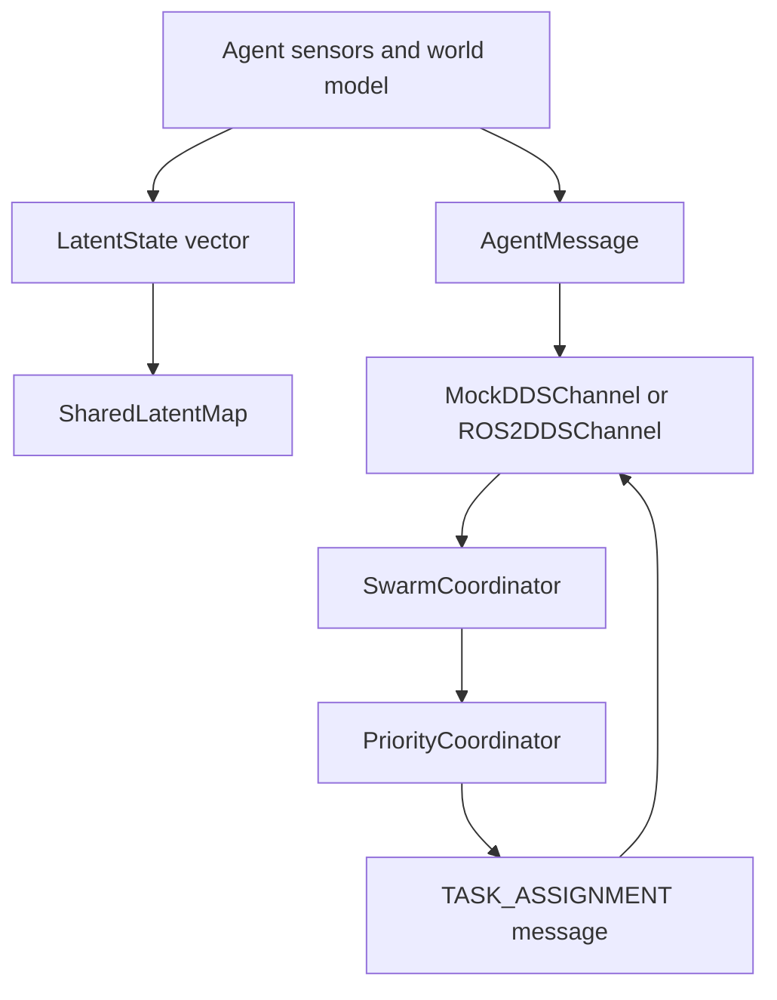

# Multi-Agent Shared World Model

## Overview

The multi-agent layer lets several vehicles share state, map updates, and task
assignments while the repository remains runnable without ROS2, GPU hardware,
Isaac Sim, PX4, MAVLink, Nav2, or CBF dependencies.

Phase 3-C adds distributed coordination infrastructure only:

- `MockDDSChannel` remains the default in-memory communication channel.
- `ROS2DDSChannel` adds a ROS2/DDS-shaped channel with pure-Python fallback.
- `SharedSpatiotemporalMap` tracks recent agent positions and observations.
- `SharedLatentMap` extends that map with latent-vector storage and fusion.
- `SwarmCoordinator` supports `round_robin` and `priority` task strategies.
- `PriorityCoordinator` computes deterministic priority assignments without
  mutating agent state.

## Data Flow

1. Agents publish `AgentMessage` objects through a `CommunicationChannel`.
2. `ROS2DDSChannel` maps message types to fleet topics and serializes messages
   into JSON-safe payloads.
3. If ROS2 bridge APIs are not injected, `ROS2DDSChannel` routes through
   `MockDDSChannel`.
4. Latent vectors are written into `SharedLatentMap` with agent id, position,
   timestamp, confidence, and metadata.
5. `SharedLatentMap` supports spatial/time-window queries and weighted latent
   fusion for nearby entries.
6. `SwarmCoordinator.assign_tasks()` keeps `round_robin` as the default.
7. With `strategy="priority"`, `SwarmCoordinator` delegates scoring to
   `PriorityCoordinator`, then applies the same state updates and
   `TASK_ASSIGNMENT` messages.

## Communication Topics

| Message type | Default topic | Purpose |
| --- | --- | --- |
| `STATE_BROADCAST` | `/fleet/agent_state` | Agent pose/status broadcasts |
| `MAP_UPDATE` | `/fleet/map_update` | Shared map or latent updates |
| `TASK_ASSIGNMENT` | `/fleet/task_assignment` | Coordinator task commands |
| `EMERGENCY_ALERT` | `/fleet/emergency_alert` | High-priority safety alerts |

`ROS2DDSChannel` is mock-first. Importing it does not import `rclpy`. Real ROS2
transport can be exercised later through an injected bridge; Phase 3-C tests use
the fallback channel and fake bridge objects only.

## Coordination Strategies

`SwarmCoordinator(strategy="round_robin")` preserves the existing behavior:
idle agents receive tasks in registry order, one active task per agent.

`SwarmCoordinator(strategy="priority")` uses `PriorityCoordinator` to rank idle
agents by configurable weights:

- Battery level from `AgentState.metadata["battery_level"]`
- Distance to `task["goal"]`, `task["position"]`, or `task["target_position"]`
- Capability match against `task["required_capability"]`
- Current load from `AgentState.metadata["current_load"]`

Tie breaks are deterministic by `agent_id`.

## Current Implementation

| Component | Status | Location |
| --- | --- | --- |
| `AgentRegistry` | Implemented | `src/multi_agent/agent_state.py` |
| `MockDDSChannel` | Implemented | `src/multi_agent/communication.py` |
| `ROS2DDSChannel` | Mock-first implementation | `src/multi_agent/ros2_dds_channel.py` |
| `SharedSpatiotemporalMap` | Implemented | `src/multi_agent/shared_map.py` |
| `SharedLatentMap` | Implemented | `src/multi_agent/shared_latent_map.py` |
| `SwarmCoordinator` | Round-robin and priority strategies | `src/multi_agent/swarm_coordinator.py` |
| `PriorityCoordinator` | Deterministic scoring planner | `src/multi_agent/priority_coordinator.py` |

## Future Directions

Future phases may add real ROS2/DDS runtime validation, decentralized consensus,
PX4/MAVLink deployment, Nav2 integration, CBF safety certificates, and richer
multi-agent evaluation metrics. Those items are outside Phase 3-C.
