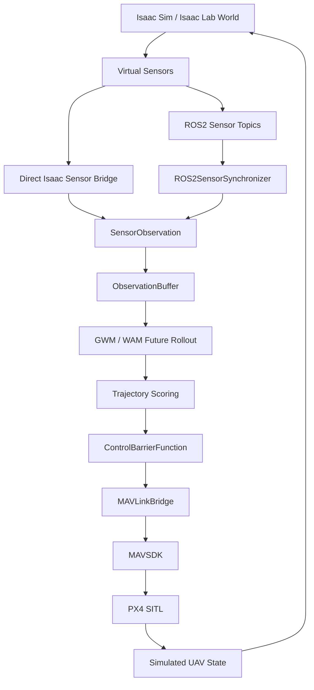

# Phase 6 Pure-Simulation Runtime

## Status

Phase 6 begins the pure-simulation full-stack runtime integration path. It is
allowed to use real simulation/runtime technologies when they are installed and
explicitly gated:

- NVIDIA Isaac Sim or Isaac Lab
- ROS2
- PX4 SITL
- MAVSDK
- Generated World Model / WAM-style planning loop
- Safety Gate / CBF

This is simulation and SITL only. It is not real hardware flight validation,
autonomous real flight, production readiness, or certified safety evidence.

Current local capability probing reported Isaac Sim, ROS2, MAVSDK, and PX4
unavailable in the active Python/shell environment. Phase 6 runtime scripts
must therefore report missing capabilities clearly until the operator installs
and activates the required stack.

## Runtime Profile

The Phase 6-A profile is:

```text
configs/runtime_profiles/pure_sim_isaac_px4_ros2.yaml
```

The repository default remains safe:

```yaml
deployment:
  mock: true
  sitl_enabled: false
  real_hardware_enabled: false
  autonomous_real_flight_enabled: false
```

The pure-simulation profile may use:

```yaml
deployment:
  mock: false
  sitl_enabled: true
  real_hardware_enabled: false
  autonomous_real_flight_enabled: false
```

The profile is not a hardware profile. It refuses real hardware and autonomous
real-flight flags.

## Target Stack

```text
Isaac Sim / Isaac Lab simulated world
  -> virtual RGB / depth / LiDAR / IMU / odometry
  -> ROS2 sensor topics or direct Isaac sensor bridge
  -> ObservationBuffer
  -> Generated World Model / WAM-style future rollout
  -> candidate trajectory scoring
  -> Safety Gate / CBF
  -> MAVSDK command bridge
  -> PX4 SITL offboard control
  -> simulated UAV state update
  -> Isaac Sim next frame
```

## Environment Gates

Runtime execution requires explicit operator opt-in:

```text
GWM_ALLOW_OPTIONAL_RUNTIME=1
GWM_RUN_ISAAC_RUNTIME_TESTS=1
GWM_RUN_ROS2_SENSOR_SYNC_TESTS=1
GWM_RUN_MAVSDK_SITL_TESTS=1
GWM_ALLOW_SITL_COMMANDS=1
```

Optional live ROS2 topics:

```text
GWM_ROS2_LIVE_TOPICS=1
```

Reserved for later explicit approval only:

```text
GWM_ALLOW_PX4_LAUNCH=1
```

Phase 6-A does not use PX4 launch approval. PX4 SITL must be started externally by the operator.

## Required External Processes

Before live Phase 6 runtime execution, the operator must prepare:

1. Isaac Sim or Isaac Lab Python environment.
2. ROS2 environment with `rclpy`, `message_filters`, `sensor_msgs`, `nav_msgs`,
   and `geometry_msgs`.
3. MAVSDK Python package.
4. Externally running PX4 SITL endpoint, normally `udp://:14540`.

The repo should run capability preflight first:

```bash
python scripts/check_runtime_capabilities.py --no-write-output
```

If a required runtime is missing, Phase 6 scripts must return
`runtime_unavailable` or an equivalent skipped/unavailable status with setup
instructions. They must not fake success.

## Slice Plan

- **Phase 6-A: Pure simulation runtime profile**
  - Adds this profile and documentation.
  - Does not launch runtimes.
- **Phase 6-B: Isaac Sim sensor runtime execution**
  - Launches or attaches to Isaac Sim when available and gated.
  - Steps a tiny scene, reads virtual sensors, converts to `SensorObservation`,
    and fills `ObservationBuffer`.
- **Phase 6-C: ROS2 simulation sensor bridge**
  - Starts simulation-only ROS2 sensor transport and validates
    `ROS2SensorSynchronizer` output.
  - No Nav2 and no hardware topics.
- **Phase 6-D: PX4 SITL + MAVSDK command validation**
  - Connects MAVSDK to externally running PX4 SITL.
  - Sends only safety-bounded offboard commands.
  - Never launches PX4 in this slice.
- **Phase 6-E: Isaac + PX4 SITL closed-loop bridge**
  - Defines state synchronization, coordinate frames, update rates, and failure
    handling.
  - Starts with a MAVSDK-only lightweight path; ROS2 / Micro XRCE-DDS remains a
    later option.
- **Phase 6-F: GWM / WAM closed-loop simulation demo**
  - Runs the full pure-simulation loop after Phase 6-B/C/D are validated.

## Data Flow



## Coordinate Frames

Phase 6-A records the frame problem explicitly and does not silently convert:

- Isaac world: Z-up.
- Project default: existing project convention.
- PX4: NED.
- MAVSDK command frame: `body_ned`.
- ROS2 sensor frames: preserved from message headers.

A future `FrameTransformPolicy` is required before claiming a coupled
Isaac/PX4 closed loop is physically valid.

## Safety And Refusal Rules

Hard refusal conditions:

- `real_hardware_enabled: true`
- `autonomous_real_flight_enabled: true`
- MAVSDK connection while `deployment.sitl_enabled: false`
- MAVSDK connection while `deployment.mock: true`
- PX4 launch attempt without a later explicit approval step
- Missing required runtime gates
- Missing required runtime capability

Every command path must apply `ControlBarrierFunction` before MAVSDK writes.
Runtime failures must send or record zero velocity, hold, land, or emergency
stop when the active backend supports it.

## Artifacts

Runtime reports belong under:

```text
outputs/runtime_validation/
```

Do not commit:

- runtime reports
- Isaac logs or artifacts
- ROS bags
- PX4 logs
- SITL artifacts
- generated datasets
- checkpoints
- credentials

## Operator Checklist

1. Install/activate Isaac Sim or Isaac Lab.
2. Source ROS2.
3. Install MAVSDK Python.
4. Start PX4 SITL externally.
5. Confirm `udp://:14540` or set `GWM_SITL_CONNECTION_URL`.
6. Set the required Phase 6 gates.
7. Run capability preflight.
8. Run Phase 6-B, Phase 6-C, and Phase 6-D independently.
9. Run Phase 6-E/F only after the independent reports are green.

## Non-Goals

- Real hardware support.
- Physical UAV connection.
- Autonomous real flight.
- Automatic PX4 launch.
- Nav2 integration.
- Production readiness.
- Formal CBF certification.
