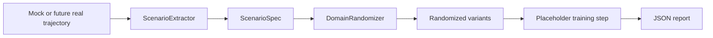

# Real2Sim2Real Pipeline

## Overview

The Real2Sim2Real pipeline is a mock-first closed-loop data engine. It mines
challenging trajectory segments, converts them into scenario specifications,
generates randomized variants, and records a report that can drive later
training and deployment work.

The current implementation does not deploy policies to real vehicles.

## Data Flow



## Current Implementation Status

| Component | Status | Module |
| --- | --- | --- |
| Scenario extractor | Implemented mock-first | `src.digital_twin.scenario_extractor` |
| Mock scene builder | Implemented descriptor path | `src.digital_twin.sim_scene_builder` |
| Isaac/OpenUSD-style builder | Implemented mock-first descriptor path | `src.digital_twin.isaac_sim_builder` |
| Domain randomizer | Implemented YAML/mock path | `src.digital_twin.domain_randomization` |
| Sim-to-real gap metric | Implemented | `src.evaluation.metrics` |
| Pipeline script | Implemented mock path | `scripts/run_real2sim2real_loop.py` |
| RL fine-tuning loop | Future work | `src.rl.fine_tune` |
| Real deployment loop | Future work | Deployment/hardware phases |

## Script

```bash
python scripts/run_real2sim2real_loop.py --mock --episode-steps 30 --variants 2
```

The script writes `r2s2r_report.json` and runs without Isaac Sim, ROS2, GPU,
PX4, ArduPilot, MAVSDK, Nav2, or real hardware.

## Boundaries

- Real flight logs can be represented later, but the current verification path
  uses mock trajectories.
- Isaac Sim runtime execution is not required; descriptor JSON is the supported
  mock-first artifact.
- Policy redeployment to real hardware is future work and must pass the
  deployment safety checklist first.
