# Real2Sim2Real Pipeline

## Overview

The Real2Sim2Real pipeline is a closed-loop data engine that bridges the gap between real-world deployment and simulation-based training.  Instead of training exclusively in a static simulator, this pipeline **continuously extracts challenging scenarios from real flight logs**, reconstructs them as digital-twin environments, applies domain randomization, fine-tunes the policy in simulation, and deploys the improved policy back to the physical platform.

The core principle is: **the real world generates the curriculum; simulation amplifies it**.

---

## Pipeline Diagram

```mermaid
flowchart LR
    subgraph Real["Real World"]
        R1[Flight Execution] --> R2[Telemetry / ROS Bag]
    end

    subgraph R2S["Real → Sim"]
        R2 --> S1[Scenario Extractor]
        S1 --> S2[Critical Event Filter]
        S2 --> S3[Scene Specification]
    end

    subgraph Sim["Simulation"]
        S3 --> S4[Digital Twin Scene Builder]
        S4 --> S5[Isaac Sim / OpenUSD Scene]
        S5 --> S6[Domain Randomizer]
        S6 --> S7[N Randomised Variants]
        S7 --> S8[RL Fine-Tuning]
    end

    subgraph S2R["Sim → Real"]
        S8 --> T1[Updated Policy]
        T1 --> T2[Validation in Sim]
        T2 --> T3[Safety Check]
        T3 --> R1
    end
```

---

## Scenario Extraction

The **Scenario Extractor** analyses real-world logs to identify segments worth replaying in simulation:

| Trigger | Description | Priority |
|---------|-------------|----------|
| Takeover event | Safety controller overrode the planner | High |
| High uncertainty | Uncertainty estimator exceeded threshold | High |
| Near-miss | Minimum obstacle clearance < 2× safety margin | Medium |
| Goal failure | Episode ended without reaching the goal | Medium |
| Novel observation | Encoder reconstruction error above threshold | Low |

For each trigger, the extractor outputs a **ScenarioSpec** containing:

- Obstacle positions and sizes (from LiDAR / depth reconstruction)
- Goal position at time of event
- Vehicle state (position, velocity, heading) at event onset
- Environmental conditions (estimated wind, lighting if available)

---

## Digital Twin Scene Building

The **Scene Builder** takes a `ScenarioSpec` and produces a simulation-ready environment:

1. **Geometry** — Place obstacles and terrain meshes matching the extracted positions.
2. **Physics** — Set gravity, drag, friction, and motor response curves.
3. **Sensors** — Configure simulated LiDAR, IMU, and depth cameras to match the real platform's sensor suite.
4. **Visual** — Apply textures and lighting (Isaac Sim backend) or skip (mock backend).

The output format is:

- **Mock backend**: JSON file containing obstacle list and physics parameters.
- **Isaac Sim backend**: OpenUSD `.usd` stage file (future implementation).

---

## Domain Randomization Strategy

Each base scene is augmented into N variant environments by randomising:

| Parameter | Range | Purpose |
|-----------|-------|---------|
| Obstacle position noise | ± 0–5 m | Robustness to mapping errors |
| Obstacle radius scale | 0.8–1.2× | Robustness to size estimation |
| Wind speed | 0–8 m/s | Robustness to aerodynamic disturbances |
| Sensor noise σ | 0.01–0.15 | Robustness to noisy observations |
| Surface friction | 0.3–1.0 | Ground-contact scenarios (UGV) |
| Lighting direction | Full hemisphere | Visual policy robustness (future) |
| Texture randomization | Random textures | Sim-to-real visual transfer (future) |

Randomization ranges are defined in the scenario YAML (see `examples/corner_case_slip.yaml` for an example).

---

## Sim2Real Transfer

After RL fine-tuning in simulation, the policy is transferred to the real platform through:

1. **Validation sweep** — Run 100+ episodes in held-out (un-randomised) simulation variants to verify no regression.
2. **Sim2Real gap metric** — Compare sim and real MetricsTrackers via `sim2real_performance_gap()`.
3. **Progressive deployment** — First deploy with lowered uncertainty threshold (conservative), then gradually relax as real-world performance is confirmed.
4. **Data collection** — The deployed policy generates new real-world logs, feeding the next iteration of the pipeline.

---

## Current Implementation Status

| Component | Status | Module |
|-----------|--------|--------|
| Scenario Extractor | ✅ Implemented (Mock) | `src.digital_twin.scenario_extractor` |
| Scene Builder (mock) | ✅ Stub | `src.digital_twin.scene_builder` |
| Scene Builder (Isaac Sim) | 🔲 Planned | `src.digital_twin.isaac_sim_builder` |
| Domain Randomizer | ✅ Implemented (YAML/Mock) | `src.digital_twin.domain_randomization` |
| RL Fine-Tuning Loop | 🔲 Planned | `src.rl.fine_tune` |
| Sim2Real Gap Metric | ✅ Implemented | `src.evaluation.metrics` |
| Pipeline Script | ✅ Implemented (Mock) | `scripts/run_real2sim2real_loop.py` |

The pipeline runs fully end-to-end under the mock backend, enabling scenario mining, randomized scene configuration, simulation placeholder steps, and automated report generation without Isaac Sim.
